# Lecture Notes: Decoupled DiLoCo

These notes explain Decoupled DiLoCo from first principles. They start with distributed systems basics, then introduce Pathways, DiLoCo, Streaming DiLoCo, and finally Decoupled DiLoCo as a resilient training architecture for large AI models.

Source documents read:

- `2311.08105v3.pdf` - DiLoCo: Distributed Low-Communication Training of Language Models
- `2604.21428v1.pdf` - Decoupled DiLoCo for Resilient Distributed Pre-training
- `Decoupled DiLoCo_ Resilient, Distributed AI Training at Scale - Google DeepMind.mhtml`
- `Introducing Pathways_ A next-generation AI architecture.mhtml`

## 1. The Core Problem

Large model training is not only a machine learning problem. It is also a distributed systems problem.

When a model is too large or a dataset is too big for one machine, training is split across many accelerators. Those accelerators must exchange information so that they continue optimizing one shared model. The traditional approach works very well when all devices are close together, reliable, and connected by extremely fast networking. It becomes painful when:

- the job spans very large numbers of chips,
- chips fail during long pre-training runs,
- some machines are slower than others,
- compute exists in multiple data centers,
- wide-area bandwidth is much lower than local data-center bandwidth,
- hardware generations differ,
- opportunistic or pre-emptible compute appears and disappears.

Decoupled DiLoCo is a response to this systems reality. It asks: what if we relaxed the requirement that every accelerator must agree on the exact same model state at every step?

## 2. Distributed Systems Basics

### 2.1 Nodes, Messages, and State

A distributed system is a collection of independent machines that cooperate by passing messages. Each machine has local state, and the system as a whole has global behavior.

In model training:

- a node may be a chip, host, worker, data-parallel replica, or whole learner unit;
- a message may contain gradients, parameters, optimizer state, metadata, or checkpoint markers;
- local state includes model weights, optimizer buffers, data iterator state, and progress counters;
- global state is the training trajectory we want the whole job to approximate.

The tension is that local machines move independently, but machine learning usually wants a coherent shared model.

### 2.2 Synchrony vs Asynchrony

In a synchronous system, participants advance in lock-step. Everyone reaches a barrier, exchanges data, and then everyone proceeds.

In an asynchronous system, participants can advance at different speeds. Messages can arrive later, and the system must decide what to do when a node is slow, unavailable, or stale.

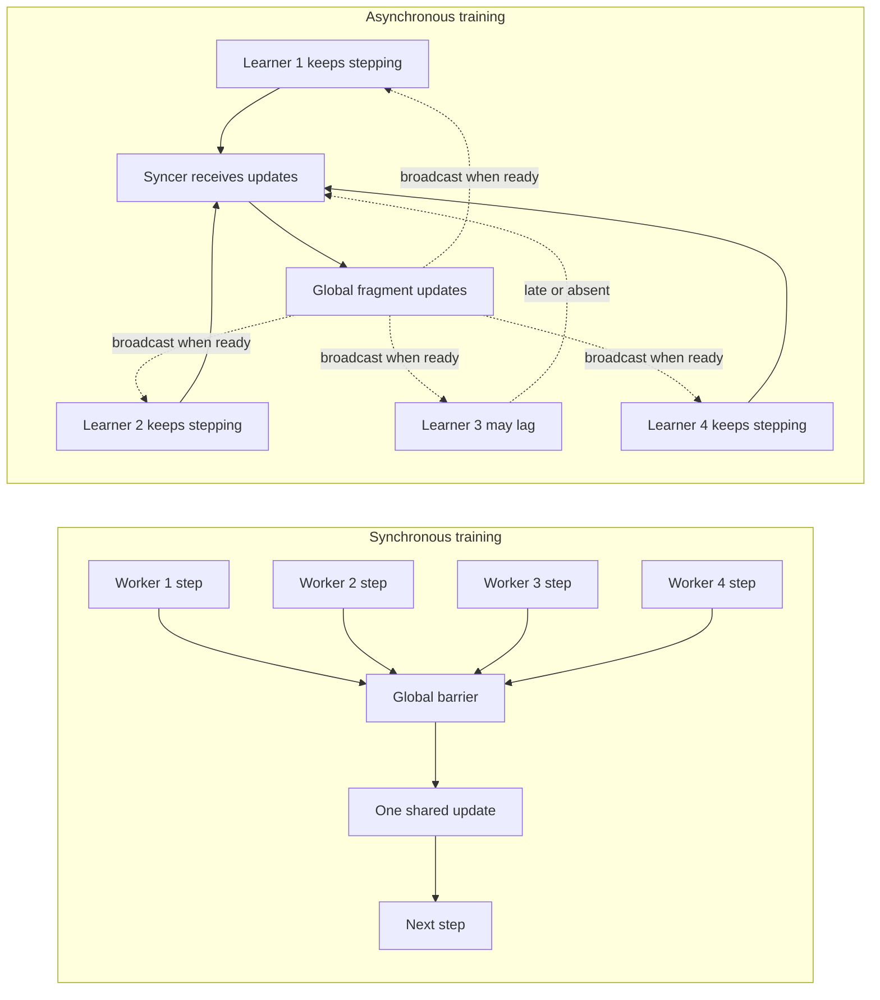

The synchronous design is easier to reason about but brittle at scale. The asynchronous design is more complex but can keep useful work going when parts of the system are delayed.

### 2.3 Consistency, Availability, and Partition Tolerance

The Decoupled DiLoCo paper frames pre-training with a CAP-like tradeoff:

- **Consistency:** every accelerator has a synchronized view of the model weights.
- **Availability:** training continues when hardware fails.
- **Partition tolerance:** training continues despite communication delays or unstable interconnects.

Traditional SPMD training strongly prioritizes consistency. Decoupled DiLoCo prioritizes availability and partition tolerance, while trying to preserve model quality.

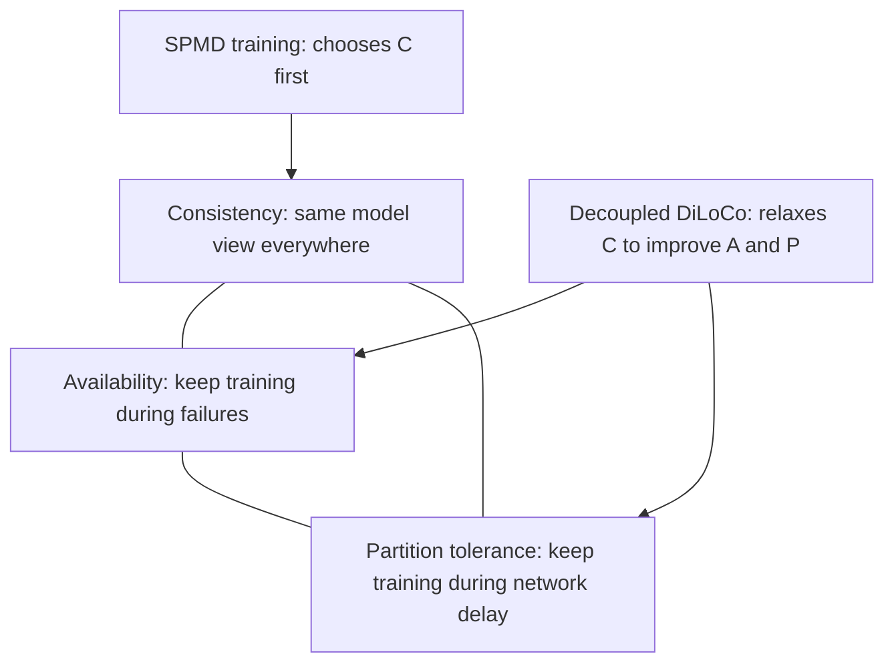

### 2.4 Stragglers and Failure Domains

A **straggler** is a slow participant that delays others. In lock-step training, the slowest worker often determines step time.

A **failure domain** is the portion of a system affected by a failure. In monolithic training, a single failed chip can stall the whole job. In Decoupled DiLoCo, a failure should mostly affect one learner, while other learners continue stepping.

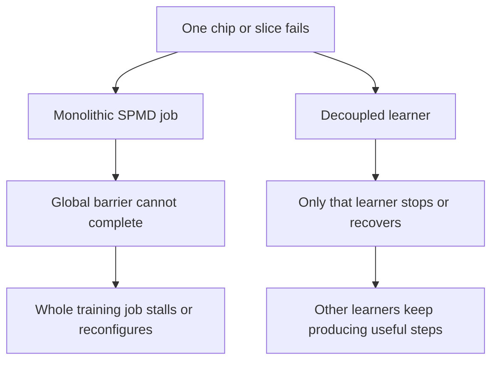

## 3. Standard Large-Scale Training

### 3.1 Data Parallelism

In data-parallel training, each replica has a copy of the model and sees a different batch of data. Each replica computes gradients. The gradients are averaged, and every replica applies the same update.

At small or moderate scale, this is natural and powerful. At frontier scale, it creates a repeated global synchronization point.

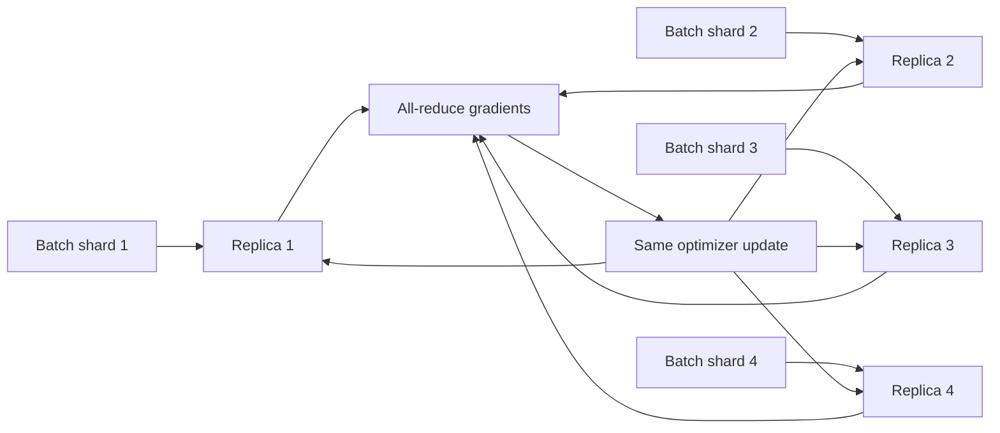

The key bottleneck is not just total communication. It is **blocking communication**: the job cannot move past the step until the collective operation finishes.

### 3.2 SPMD

SPMD means **single program, multiple data**. The same program runs across many devices, often using data, tensor, pipeline, or sequence parallelism. It assumes close coordination across participants.

SPMD is the dominant paradigm because it gives clean semantics: the distributed job behaves like one giant machine. The cost is that it makes the giant machine fragile. If one slice fails or slows down, the global step is delayed.

## 4. Pathways

The Pathways blog introduces a broader AI architecture vision:

- one model should be able to handle many tasks, not just one;
- models should handle multiple modalities, such as text, image, and audio;
- models should be sparsely activated, so only relevant parts of a large network are used for a given task.

For Decoupled DiLoCo, the most relevant idea is not only model capability. It is the systems style: Pathways is about flexible distributed execution and asynchronous data flow.

The Decoupled DiLoCo paper says its workers are orchestrated by Pathways, which manages:

- resource allocation,
- device mesh construction,
- inter-worker dataflow,
- separate Pathways clients for worker isolation.

Think of Pathways as the substrate that can coordinate many independent ML computations without forcing everything into one tightly coupled global step.

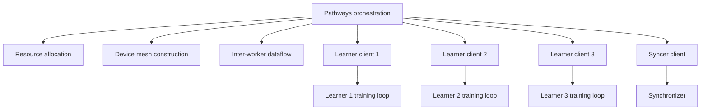

The conceptual link:

- Pathways supplies a way to coordinate flexible distributed ML programs.
- DiLoCo supplies a low-communication training algorithm.
- Decoupled DiLoCo combines them into an availability-first pre-training architecture.

## 5. DiLoCo

DiLoCo stands for **Distributed Low-Communication** training.

The original DiLoCo paper starts from a practical observation: it may be easier to find several smaller clusters of accelerators than one enormous tightly connected cluster. Those smaller clusters may be in different places and connected by weak links. DiLoCo is designed for this setting.

### 5.1 Federated Learning Intuition

DiLoCo is inspired by Federated Averaging:

1. Multiple workers each keep a model replica.
2. Each worker trains locally for many steps.
3. Workers periodically communicate their model changes.
4. A global update merges the local progress.
5. The updated global model is sent back to workers.

The difference is that DiLoCo is aimed at language model pre-training, not phone-scale federated learning. It uses modern optimizers and large accelerator islands.

### 5.2 Inner and Outer Optimization

DiLoCo has two loops:

- **Inner loop:** each worker trains locally for `H` steps using AdamW.
- **Outer loop:** after those `H` steps, workers compute parameter deltas; the system averages those deltas and applies an outer optimizer, typically SGD with Nesterov momentum.

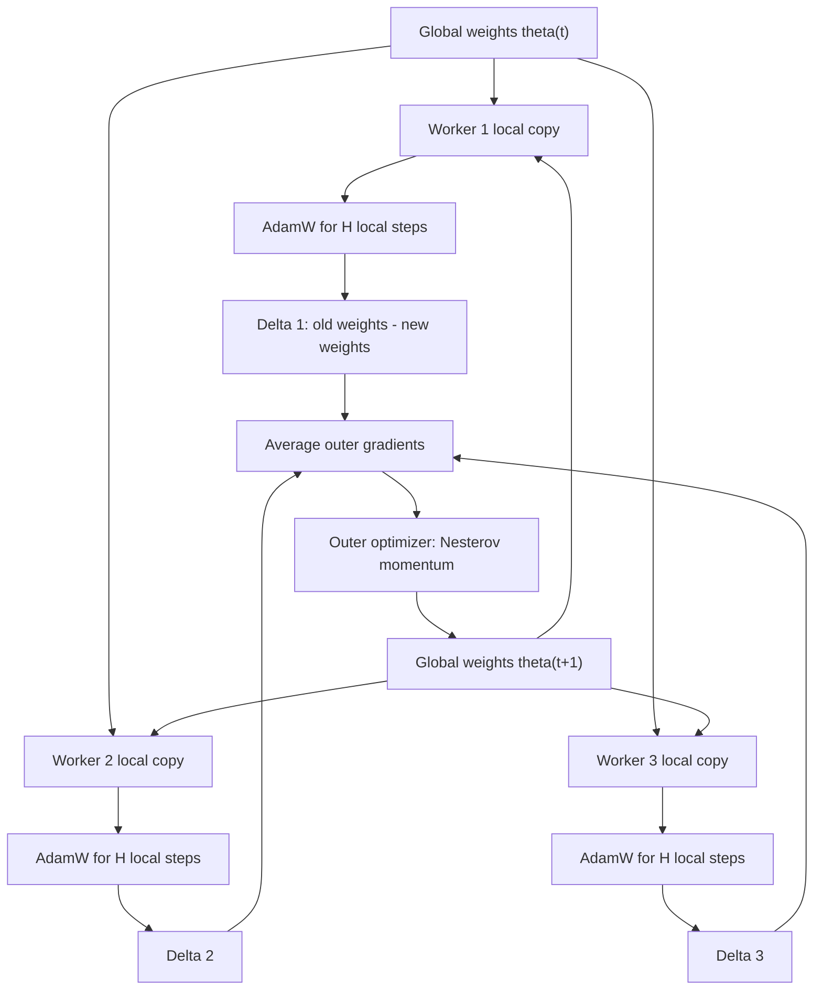

If `H = 500`, workers communicate once every 500 local steps instead of every step. The DiLoCo paper reports that with 8 workers on C4, DiLoCo reached comparable or better perplexity than a fully synchronous baseline while communicating about 500 times less.

### 5.3 What DiLoCo Solves

DiLoCo reduces total communication because workers do many local steps before synchronizing. It also allows each worker to be an island of devices, so the inner loop can use normal local data and model parallelism while the outer loop communicates infrequently across islands.

Useful properties from the paper:

- inner optimizer: AdamW;
- outer optimizer: Nesterov momentum;
- default communication interval in key experiments: `H = 500`;
- robust to non-identical data shards;
- robust to workers becoming unavailable or available over time;
- same inference model size and speed as ordinary training.

### 5.4 What DiLoCo Does Not Fully Solve

DiLoCo still has a synchronization barrier. Every outer step waits for the participating workers. A worker failure or straggler can still delay the outer synchronization.

This is the opening for Decoupled DiLoCo.

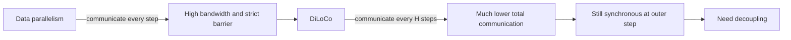

## 6. Streaming DiLoCo as the Bridge

The Decoupled DiLoCo paper describes Streaming DiLoCo as an intermediate step.

DiLoCo reduces **total bandwidth** by communicating every `H` steps. But if the entire model is synchronized at once, peak bandwidth can still be high. Streaming DiLoCo partitions the model into `P` fragments and synchronizes fragments at different offsets.

Instead of sending the whole model update in one burst:

- split weights into fragments,
- send one fragment on a schedule,
- overlap communication with continued training,
- receive an updated fragment a few steps later.

```mermaid
gantt
  title Fragmented Synchronization Intuition
  dateFormat X
  axisFormat %s
  section Learner compute
  Local step 1 : 0, 1
  Local step 2 : 1, 1
  Local step 3 : 2, 1
  Local step 4 : 3, 1
  section Communication
  Send fragment A : 0, 1
  Send fragment B : 1, 1
  Send fragment C : 2, 1
  Receive updated A : 2, 1
  Receive updated B : 3, 1
```

Streaming DiLoCo improves total and peak bandwidth and makes communication overlap with computation. But the paper emphasizes that it still requires lock-step training across learners when used with collective synchronization. It reduces communication pain, but not the failure-domain problem.

## 7. Decoupled DiLoCo

Decoupled DiLoCo removes the lock-step assumption between learners.

Instead of all learners synchronizing together, each learner runs its own training loop and communicates parameter fragments asynchronously to a central synchronizer, called the **syncer**.

The syncer does not wait for all learners. It uses:

- **minimum quorum:** aggregate once at least `K` learners have reported;
- **adaptive grace window:** wait a little longer if there is safe slack, so more learners can join without reducing goodput;
- **token-weighted merging:** weight contributions based on how much useful data a learner processed and how stale or amortized its update is;
- **fragment-wise outer optimization:** update one model fragment at a time;
- **Radial-Directional Averaging:** merge update directions and magnitudes in a way that is more stable as the number of learners scales.

### 7.1 High-Level Architecture

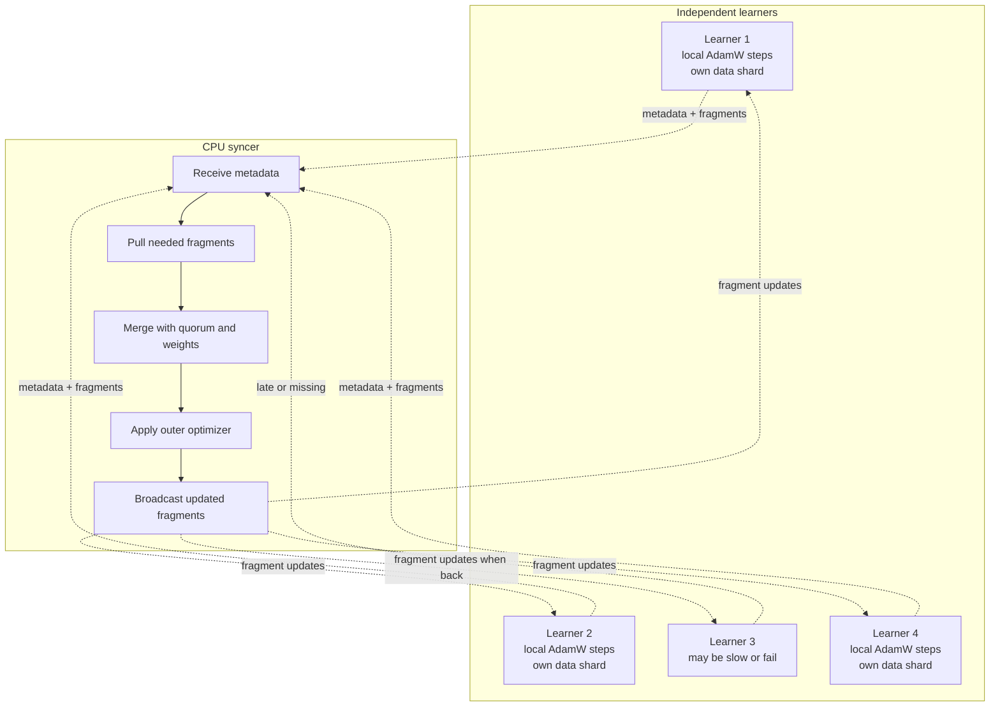

Each learner keeps stepping locally. It sends metadata to the syncer, including:

- local step count,
- per-fragment step counters,
- per-fragment token counters.

When a learner receives an updated fragment from the syncer, it overwrites that local fragment and resets the fragment counters. The learner does not need to stop the whole training loop to do this.

### 7.2 The Learner

A learner is like a smaller training job:

- it owns a model copy;
- it trains on its own data shard;
- it uses an inner optimizer such as AdamW;
- it sends metadata every step;
- it listens for updated fragments from the syncer;
- it can run at a different speed from other learners;
- it can fail and recover without halting the whole job.

This is the main systems shift: learners are isolated. They share no accelerator resources and normally do not communicate directly with one another.

### 7.3 The Syncer

The syncer holds the global model fragments and outer optimizer state. It is lighter than a learner because it does not do full forward/backward training with activations. The paper describes it as CPU-only and sharded.

At a scheduled fragment step, the syncer:

1. waits until at least `K` learners report metadata;
2. optionally waits during an adaptive grace window;
3. pulls the relevant fragment from available learners;
4. computes learner weights;
5. merges the fragment updates;
6. applies the outer optimizer;
7. sends the updated fragment back to learners.

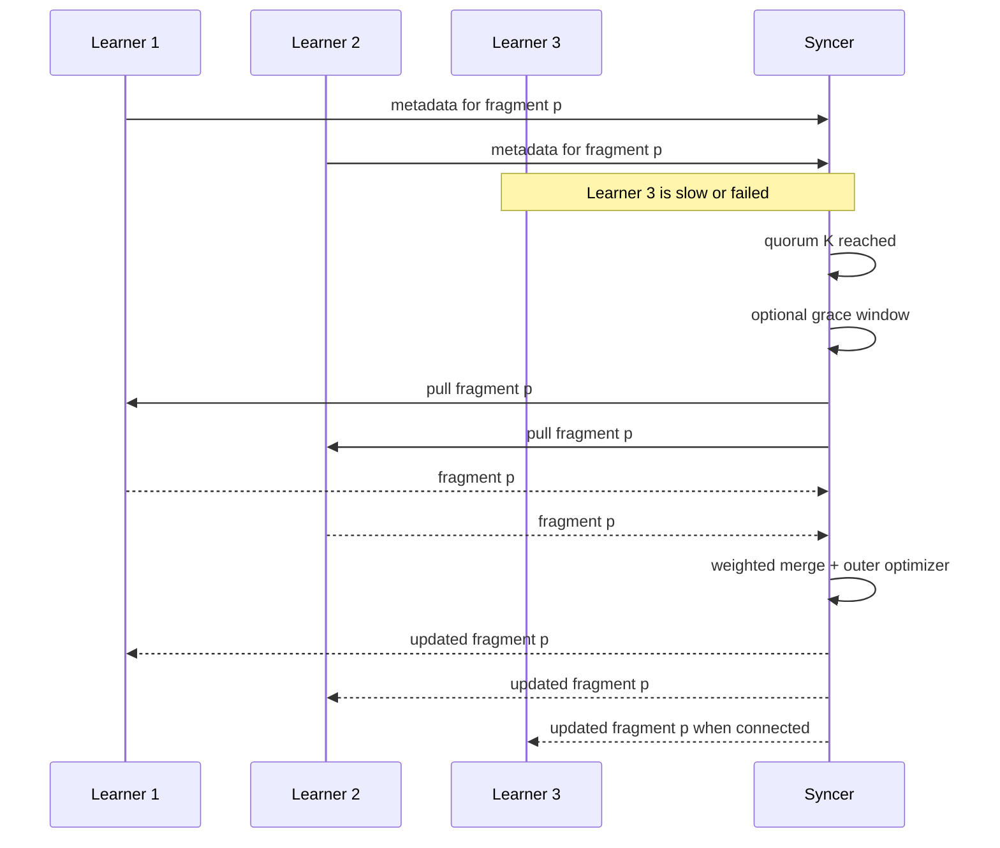

### 7.4 Minimum Quorum

In synchronous training, the effective quorum is all workers. If there are `M` learners, all `M` must participate.

In Decoupled DiLoCo, the quorum can be lower: `K <= M`. If `K = 1`, the syncer can proceed after one learner has useful information. In practice, the grace window may allow more learners to join when there is spare time.

The tradeoff:

- smaller `K` improves availability and avoids stalls;
- larger `K` improves sample efficiency by using more learner updates per merge;
- adaptive grace tries to get the best of both when there is slack.

### 7.5 Adaptive Grace Window

If communication finishes faster than the compute overlap budget, the syncer has slack. Instead of immediately applying an update as soon as quorum is reached, it can wait briefly for more learners.

The paper defines slack approximately as:

```text
slack = overlap_steps * step_time - (quorum_time + sync_time)
grace <= safety_margin * slack
```

This is a systems-aware algorithmic trick. It uses idle communication slack to include more training signal without reducing useful compute time.

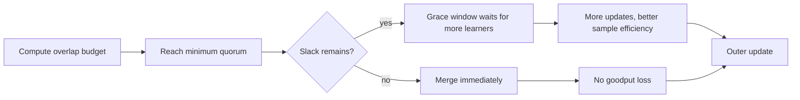

### 7.6 Token-Weighted Merging

In a decoupled system, not every learner contributes equally:

- a fast learner may process more tokens;
- a slow learner may contribute stale information;
- a recovering learner may have just rejoined;
- different learners may have different step counts since their last fragment update.

The syncer uses a dynamic weighting function based on per-fragment token and step counters. The intuition is:

```text
weight = quantity * quality
quantity: how many tokens the learner processed
quality: how concentrated the update is per step
```

This avoids treating a stale, low-information update exactly like a fresh, high-throughput update.

### 7.7 Radial-Directional Averaging

The paper notes that per-learner outer gradients can be nearly orthogonal. If you directly average many nearly orthogonal vectors, the norm of the average shrinks roughly as the number of learners grows. That can force retuning of the outer optimizer.

Radial-Directional Averaging, or RDA, separates:

- **radial part:** the update magnitude;
- **directional part:** the normalized update direction.

It averages magnitudes and directions separately, then recombines them. This preserves update scale more reliably as the number of learners increases.

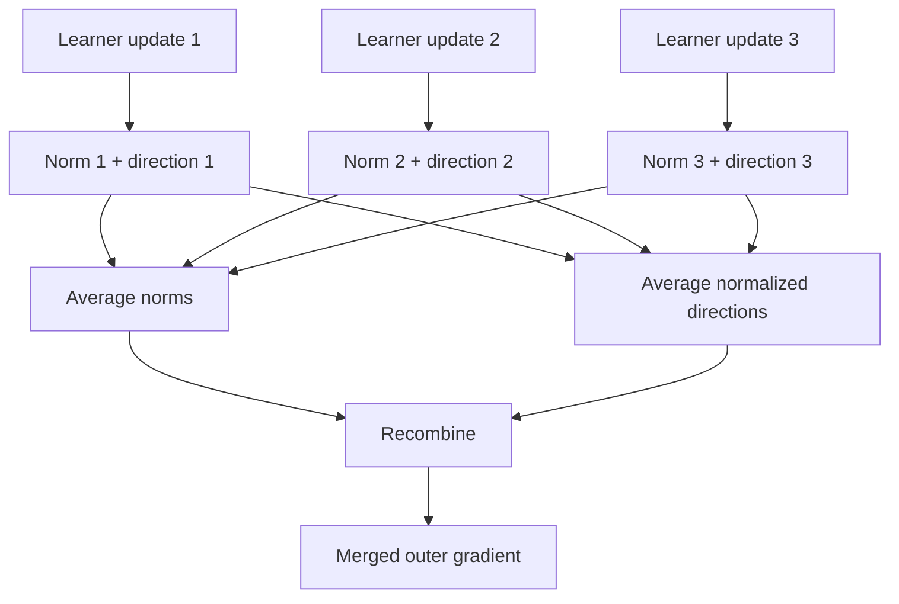

The implementation detail from the paper: their primary experiments use direct averaging for the embedding component and RDA for the rest of the model.

### 7.8 Balanced Tensor Fragmentation

Because Decoupled DiLoCo communicates fragments, fragment design matters.

The paper compares:

- **layer fragmentation:** natural semantically, but can create bursty communication;
- **tensor fragmentation:** more frequent communication, but fragment sizes may be uneven;
- **balanced tensor fragmentation:** greedy bin-packing of tensors into similarly sized fragments.

Balanced tensor fragmentation is chosen because model quality is robust across strategies, while balanced fragments reduce peak bandwidth and avoid bursts.

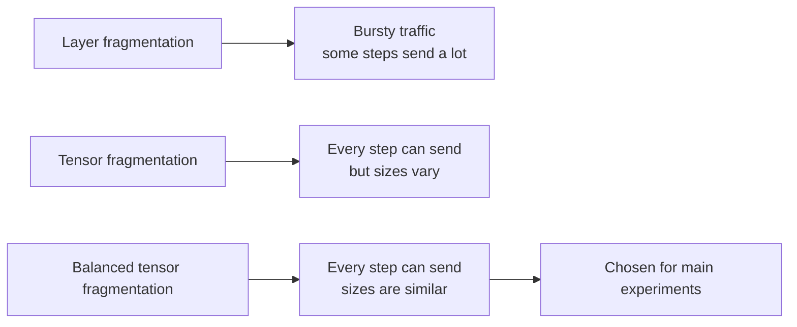

## 8. How Decoupled DiLoCo Changes Failure Behavior

### 8.1 From Global Downtime to Local Degradation

In monolithic SPMD, a failed slice can force global waiting, replay, checkpoint restore, or reconfiguration. Decoupled DiLoCo limits the blast radius.

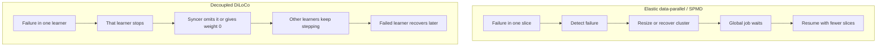

This is the central systems benefit: the job may lose some capacity, but it avoids a global stop.

### 8.2 Chaos Engineering

The Decoupled DiLoCo paper applies chaos engineering to training. Instead of only testing ideal runs, it simulates failures with parameters such as:

- mean time between interruptions per chip,
- number of simulated chips,
- chip speed variance,
- downscale and upscale time,
- time for failed chips to return.

For a fixed per-chip interruption rate, cluster-level mean time between failures falls as the number of chips rises:

```text
cluster_MTBF = per_chip_MTBI / number_of_chips
```

That means rare chip failures become normal system events at very large scale.

### 8.3 Goodput

Goodput is the percentage of allocated cluster time spent doing useful training work. A system can have many chips allocated and still have poor goodput if it spends too much time waiting, resizing, replaying, or communicating.

The paper reports modeled goodput under aggressive simulated failures. A useful headline result:

- elastic data-parallel at 1.2 million simulated chips: about 58% goodput;
- Decoupled DiLoCo with 8 learners at the same simulated scale: about 88% goodput;
- with enough learners, system uptime can be effectively 100% in the simulations.

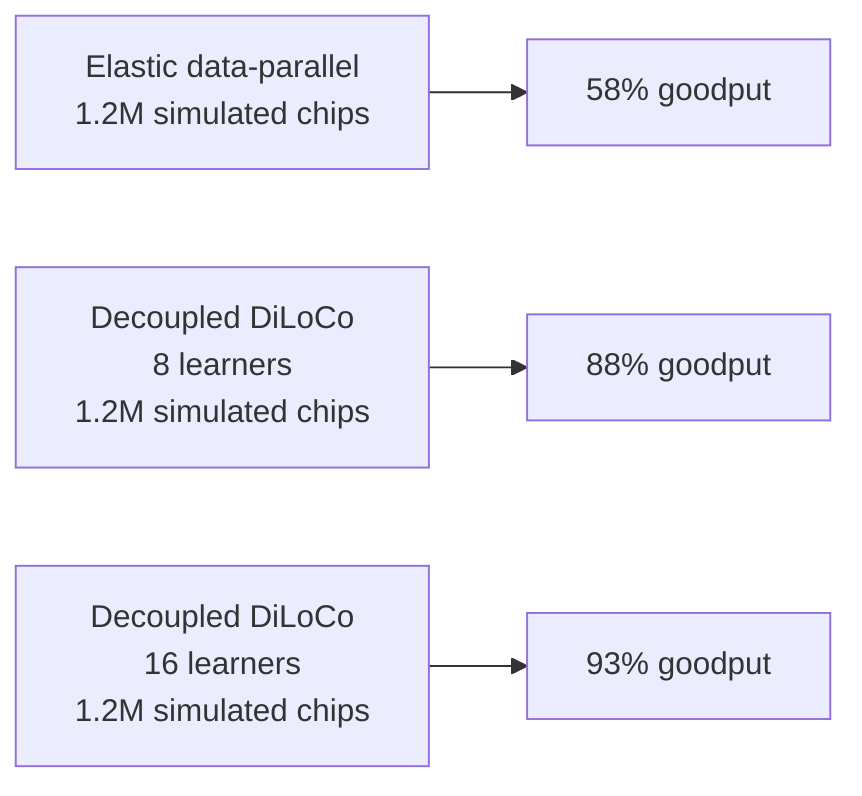

The machine learning result is equally important: downstream text and vision performance remains competitive even under failure simulation.

## 9. Experiments and Evidence

### 9.1 DiLoCo Evidence

From the DiLoCo paper:

- 8 workers on C4 can match or beat fully synchronous optimization in the reported setting;
- communication can be reduced by about 500x when `H = 500`;
- DiLoCo is robust to different data distributions across workers;
- DiLoCo can handle workers becoming unavailable or newly available.

The key limitation was that DiLoCo remained synchronous at the outer step.

### 9.2 Decoupled DiLoCo Evidence

From the Decoupled DiLoCo paper and DeepMind blog:

- Decoupled DiLoCo uses independent learners and an asynchronous syncer.
- It trains with minimum quorum, adaptive grace, token-weighted merging, balanced tensor fragmentation, and RDA.
- It is evaluated on Gemma 4 variants with text and vision data.
- It matches data-parallel performance across dense and MoE architectures in the reported settings.
- It maintains much higher goodput than elastic data-parallel under heavy simulated hardware failures.
- It supports heterogeneous hardware, such as mixed TPU generations.
- It supports compute scavenging by adding temporary learners during training.
- A 12B parameter model was trained across four U.S. regions using 2-5 Gbps of wide-area networking, according to the DeepMind blog.

### 9.3 Comparison Table

| Approach | Communication Pattern | Failure Behavior | Strength | Weakness |
|---|---|---|---|---|
| Standard data parallel | Every step all-reduce | One slow or failed participant can stall the step | Simple semantics and strong consistency | High bandwidth and global barrier |
| Elastic data parallel | Every step all-reduce, with reconfiguration | Can resize after failure, but reconfiguration causes downtime | Preserves standard training semantics | Still globally coordinated |
| DiLoCo | Communicate every `H` local steps | Better than step-level sync, but outer sync is still blocking | Huge reduction in total communication | Still synchronous across workers |
| Streaming DiLoCo | Fragmented communication overlapped with training | Better bandwidth profile, but still lock-step in collective form | Reduces total and peak bandwidth | Still vulnerable to learner stalls |
| Decoupled DiLoCo | Async fragment exchange with syncer | Failed learners are omitted or recovered while others continue | Availability-first, geo-distributed, heterogeneous-friendly | More complex convergence and systems design |

## 10. Mental Model

The easiest way to understand the progression is:

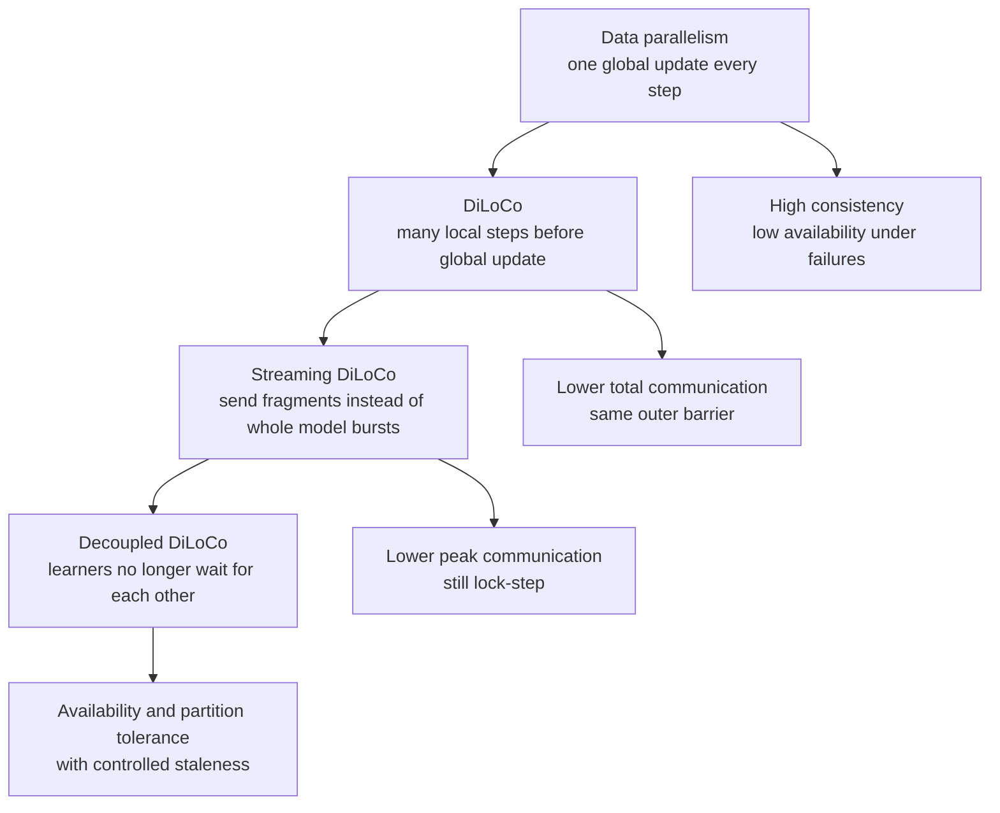

Decoupled DiLoCo is not just "DiLoCo but asynchronous." It is a co-design of:

- optimization algorithm,
- fragment schedule,
- merge rule,
- failure handling,
- checkpointing,
- recovery,
- orchestration,
- bandwidth management.

## 11. Practical Intuitions

### 11.1 Why Local Training Can Work

Local training works because nearby points in model space often remain mergeable for some number of steps. DiLoCo exploits this by allowing workers to train independently before merging parameter deltas. The outer optimizer turns the collection of local deltas into a global training trajectory.

This is related to federated optimization and local SGD, but tuned for transformer pre-training with AdamW inside and momentum outside.

### 11.2 Why Decoupling Can Work

Decoupling works if the system can tolerate bounded staleness and partial participation. The syncer keeps a global trajectory moving by incorporating whatever learner updates arrive in time, weighted by useful progress. Fragmented updates keep communication smooth. Grace windows use spare time to improve sample efficiency. Recovery protocols bring failed learners back without requiring the whole job to stop.

### 11.3 Why Scale Makes This More Valuable

At small scale, strict synchrony is manageable. At huge scale, the probability of some component failing becomes high. The systems advantage of Decoupled DiLoCo grows with:

- more chips,
- longer training runs,
- more geographically distributed compute,
- greater hardware heterogeneity,
- more opportunity to use temporary compute.

The paper explicitly argues that the settings with the strongest systems need are also the settings where Decoupled DiLoCo's model quality is most comparable to SPMD training.

## 12. Key Terms

| Term | Meaning |
|---|---|
| SPMD | Single program, multiple data; one coordinated program across many devices. |
| Data parallelism | Replicate model, split data, average gradients every step. |
| Barrier | Synchronization point where all participants must arrive before proceeding. |
| Straggler | Slow participant that delays a synchronous job. |
| Goodput | Fraction of allocated time spent on useful training. |
| Learner | Independent Decoupled DiLoCo training unit with its own model copy and data shard. |
| Syncer | Central synchronizer that aggregates fragment updates and applies outer optimization. |
| Inner optimizer | Local optimizer used by learners, typically AdamW. |
| Outer optimizer | Optimizer applied to merged parameter deltas, typically Nesterov momentum. |
| Fragment | Subset of model parameters synchronized separately. |
| Quorum | Minimum number of learner reports needed before the syncer can merge. |
| Grace window | Extra wait time used to include more learners when slack allows. |
| RDA | Radial-Directional Averaging, a merge rule that separates magnitude and direction. |
| Staleness | How out-of-date a learner's fragment or optimizer state is relative to the global trajectory. |
| Compute scavenging | Temporarily adding available compute to a training run. |

## 13. Summary

Pathways gives the systems direction: flexible, asynchronous distributed ML execution. DiLoCo gives the training algorithm direction: let model replicas train locally for many steps and communicate infrequently. Streaming DiLoCo improves the bandwidth profile by fragmenting updates. Decoupled DiLoCo completes the shift by removing the lock-step learner barrier.

The result is an availability-first training architecture. Learners keep stepping independently. The syncer reconciles parameter fragments using quorum, grace windows, token-weighted merging, and robust outer optimization. Failures become local disruptions rather than global downtime. In the reported experiments, this preserves downstream model quality while materially improving goodput under failure-prone, heterogeneous, and geo-distributed conditions.

## 14. Self-Check Questions

1. Why does standard data parallelism create a global failure domain?
2. What does DiLoCo communicate every `H` steps?
3. Why does DiLoCo reduce total communication but not fully solve straggler problems?
4. What does Streaming DiLoCo add?
5. What role does the syncer play in Decoupled DiLoCo?
6. Why is a minimum quorum useful?
7. What does the adaptive grace window trade off?
8. Why might direct averaging shrink update norms as the number of learners grows?
9. How does Decoupled DiLoCo support heterogeneous hardware?
10. Why does the value of Decoupled DiLoCo increase as the number of chips grows?
